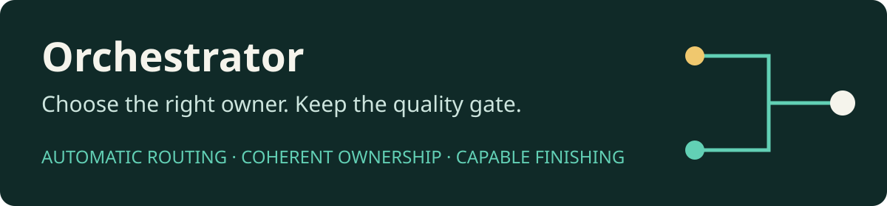

<p align="center">
  
</p>

# Orchestrator

**Automatically choose direct execution or a cheaper implementation owner with
capable finishing.** A skill for Codex, Claude Code and OpenClaw that optimises
total accepted-delivery cost, including setup, integration, verification and repair.

[](https://github.com/Tasogarre/orchestrator/actions/workflows/validate.yml)
[](LICENSE)

[Install](#install) · [Routing](#how-it-chooses) · [Results](#final-evidence) ·
[Lessons](#what-we-learned) · [Research](#research-behind-the-design) ·
[Limitations](#limitations-and-no-guarantees)

## Install

Requires a compatible skill-capable host. **Inspect an existing destination
before installing; do not overwrite it.** For multiple hosts, clone once and
link their skill directories after checking for existing installations.

### Codex

```bash
mkdir -p "$HOME/.agents/skills"
git clone https://github.com/Tasogarre/orchestrator.git \
  "$HOME/.agents/skills/orchestrator"
```

```text
Use $orchestrator to implement this change. Preserve the existing API and tests.
```

### Claude Code

```bash
mkdir -p "$HOME/.claude/skills"
git clone https://github.com/Tasogarre/orchestrator.git \
  "$HOME/.claude/skills/orchestrator"
```

Invoke `/orchestrator` with your task. Claude performance is not yet benchmarked.

### OpenClaw

With a compatible skills installer:

```bash
openclaw skills install git:Tasogarre/orchestrator@main --global
```

Name the skill in your task prompt. Keep existing model routes and agent allowlists.
For reproducible installs, replace `main` with a reviewed commit or release ref.
See [host adapters and official documentation](references/hosts.md).

### Start on a capable model

**Your current session model makes the ownership decision** and retains intent,
planning, authority and final acceptance. Use a model you trust with that
judgement, such as a capable Sol-class or Opus-class model at suitable effort.
These are role examples, not benchmark claims.

Describe the task and any deadline, budget or acceptance constraints.
**You do not choose a route mode.** The skill does not upgrade your main model,
buy a separate router call, install credentials, add profiles or start services.
Changing the session model changes the decision-maker; selecting workers does not.
Delegating implementation cannot compensate for a weak decision-maker.

### Verify and update

From the cloned checkout:

```bash
PYTHONDONTWRITEBYTECODE=1 python3 -m unittest discover -s tests -v
python3 scripts/run_codex_agent.py --help
```

These checks call no model. The optional `doctor` uses live Codex allowance or API
usage; it is not required for installation and CI does not run it.

Update a clean Git clone with `git pull --ff-only`; preserve local edits.
OpenClaw Git installs use its documented reinstall flow. Start a fresh session
to avoid stale loaded instructions. Codex `--profile` configuration is separate
and unchanged. Model availability depends on your account.

## How it chooses

The capable session decides inline, using its existing context.
**Direct execution is a valid outcome**, especially when delegation costs more.

| Stay direct | Delegate to one coherent owner + fresh capable finisher |
| --- | --- |
| Small task or strong warm-context advantage | Substantial, clearly bounded unit |
| Ambiguous task or exploratory debugging | Clear acceptance and owned paths |
| Tightly coupled work or sensitive decisions | Meaningful objective and compatibility checks |
| Handoff and repair outweigh savings | Plausible saving after finishing and repairs |
| Tight deadline or unsupported model/effort | Supported runtime and acceptable added latency |

All delegation gates must hold; otherwise the skill stays direct and briefly
explains why. Direct work still receives required reviews and quality checks.

The measured Codex tactic is **Luna Max → fresh Sol High finishing**. Other
families use supported lower-cost strong owners and capable finishers; there
is no universal "Max" parameter. Those mappings are unmeasured, and unsupported
routes stay direct.

The finisher can repair demonstrated defects within scope. Writers work
sequentially on a coherent unit, checks rerun after repairs, and the parent
accepts the result. Study quality tolerances never override your requirements.

<details>
<summary>Routing flow</summary>

```text
Task + acceptance + runtime capabilities
                    │
           Inline ownership decision
              ┌─────┴─────┐
              │           │
        Direct owner   One coherent cheaper owner
              │        at supported strong effort
              │           │
              │        Fresh capable finisher
              │        with scoped repair access
              └─────┬─────┘
                    │
          Objective + semantic checks
                    │
          Parent integration / acceptance
```

</details>

### No eval infrastructure required

Use Orchestrator in your normal coding session: **no Docker, Lima, VM, separate
sandbox service or benchmark is required**.

- **Execution permissions** protect ordinary work. The optional Codex helper's
  `--sandbox` selects a Codex policy: `read-only` for inspection roles and
  `workspace-write` for implementation roles by default. It creates no container.
- **Eval isolation** is optional: fresh, credential-free task copies, private
  withheld checks and independent grading for controlled comparisons.

Sandbox enforcement depends on the host/platform; it does not guarantee
credential isolation or every assigned-file boundary. The parent still enforces
authority, scope and verification. Stay direct rather than bypassing protections.

Normal tests and acceptance checks suffice for everyday work. To measure your
own workloads, use isolated copies, equivalent finishing and independent grading
per the [methodology](references/evaluation.md). The private eval harness and
raw task evidence are not bundled.

<details>
<summary>Optional Codex Python helper: what it does</summary>

[`scripts/run_codex_agent.py`](scripts/run_codex_agent.py) is a CLI adapter,
not a router. Prefer native agent tools when they support the required model,
effort, fresh context and workspace boundary. Claude Code and OpenClaw can use
authorised native tools or supported adapters without this helper.

The fallback needs Python 3.10+ and an authenticated, compatible Codex CLI.
After the parent selects a route, it launches a fresh `codex exec` child with
the chosen model, effort, directory and sandbox; disables nested delegation;
and returns the answer, reported tokens, duration and errors as JSON.
It handles timeouts/cancellation and rejects detected concurrent worktree or
output/log collisions. The parent still scopes, inspects and verifies the work.

It uses existing Codex authentication, not a separate API client or embedded
credential. Live calls consume Codex allowance or API usage; `--dry-run` does not.
It creates no daemon, container or VM and does not change your main model/profile.

Children intentionally ignore global user settings, including hooks and
provider/profile preferences; use native tools when those must apply.
See [routing details](references/routing.md).

</details>

## Final evidence

On **two selected bounded diagnostics**, **GPT-6 Luna Max implementation →
fresh GPT-6 Sol High finishing and repair** cost **30.7–34.8% less** at equal
**100/100** quality. Model-stage time was **34.3–95.6% longer**.

| Task | Max + finishing | Direct + equal finishing | Cost saving | Time increase | Quality, tactic / direct |
| --- | ---: | ---: | ---: | ---: | ---: |
| Instance defaults | $0.28281 | $0.43346 | 34.8% | 34.3% | 100 / 100 |
| Strict offset alignment | $0.21262 | $0.30672 | 30.7% | 95.6% | 100 / 100 |

**These are not executions of the published automatic-routing skill**, an
overall study effect or a guaranteed Orchestrator-versus-direct win.
The policy's comparative performance remains unmeasured.

Both arms had the same fresh Sol High finish-and-repair opportunity, followed
by independent objective checks and blind scoring. API-equivalent estimates
include routing, implementation/integration, repairs and finishing, excluding
shared case preparation and independent grading. Time is model-stage only.
Pricing uses frozen **2026-09-23** rates and actual cache mix, not subscription
billing or current prices. Direct without equal finishing is unmeasured.

[Methodology and final findings](references/evaluation.md) ·
[Machine-readable aggregate results](docs/results.json)

### Research and testing investment

**345,097,261 tokens · 426 deduplicated complete calls · $127.86 API-equivalent.**

This audited retained subtotal includes scenario preparation, grading and the
final study—not the cost of using the skill on one task.

<details>
<summary>Token breakdown and accounting scope</summary>

| Recorded usage | Tokens |
| --- | ---: |
| Input | 341,131,707 |
| ↳ Cached input, already included above | 322,719,488 |
| ↳ Uncached input | 18,412,219 |
| Output | 3,965,554 |
| ↳ Reasoning output, already included above | 1,991,356 |
| **Total input + output** | **345,097,261** |

The $127.86 estimate uses frozen rates. Excludes the main conversation, absent
archives, incomplete receipts and unmetered engineering reviews; it is not an
exact lifetime total. Cached input and reasoning output are subsets, not extra
tokens. Raw traces and intermediate experiments remain private; only final
insights and aggregates are public.

</details>

## What we learned

**Delegate selectively; preserve acceptance.** Agent count is not the goal.

| Pattern that did not reliably pay off | Lesson applied |
| --- | --- |
| Delegate because worker rates are lower | Setup, repeated investigation, integration and finishing can erase savings. Judge the complete accepted-delivery cost. |
| Split small or tightly coupled changes | Handoffs add overhead; clean merges do not prove compatibility. Keep one coherent owner; parallelise independent research or isolated units. |
| Trust capable review to rescue cheap implementation | Review can miss defects or change correct behaviour. Give a fresh finisher scoped repair access, preserve green behaviour and rerun checks. |
| Raise effort and assume quality is solved | Higher effort did not reliably rescue every workload. Keep a precise contract and task-specific compatibility checks. |
| Minimise tokens alone | Rates and cache mixes matter: more tokens can cost less. Price uncached input, cached input and output separately; track quality and elapsed time. |

These are observed limitations, not claims that those patterns never work.

**Promising, not conclusive:**

- **Coherent Max + finishing:** strongest final price-sensitive tactic on the two
  diagnostics, with added latency; needs broader tasks and independent repeats.
- **Lower-effort cheap ownership:** sometimes cheaper/faster, but quality was
  inconsistent; stronger effort still cannot replace verification.
- **Inline routing:** avoids a separate router call; shipping-policy end-to-end
  cost and quality remain unmeasured.
- **Parallel research:** plausible for independent, information-heavy questions;
  coding diagnostics do not quantify its benefit.
- **Cross-family use:** portable framework; Claude and GPT-6.1 need matched solver
  studies before quality, speed or savings claims.

## Research behind the design

Research informs the policy, **not the numerical GPT-6 savings above**:

- Anthropic's [Building effective agents](https://www.anthropic.com/engineering/building-effective-agents):
  simplest effective workflow; complexity costs time and money. Stay direct
  unless delegation has a defensible benefit.
- [Towards a Science of Scaling Agent Systems](https://arxiv.org/abs/2512.08296):
  coordination, task topology and model capability interact. Choose ownership
  boundaries before agent count or tier.
- Anthropic's [multi-agent research system](https://www.anthropic.com/engineering/multi-agent-research-system):
  parallel research needs independent work and explicit briefs. Batch independent
  readers; keep coherent implementation and finishing sequential.

## Limitations and no guarantees

**Results are not guaranteed and will vary** with workload/task, initiating
model, worker/finisher, harness, effort, tools, context warmth, cache reuse,
pricing, latency and acceptance coverage.

- Evidence is primarily GPT-6. **Claude-family and GPT-6.1 solver evaluations
  are backlogged and unmeasured**, even if those models can use the skill.
- Two diagnostics do not establish statistical generalisation. Equal rubric
  scores do not prove bug-free output; some broader dependency fixtures were
  unavailable.
- This is model-applied policy, not an enforced routing service. Verify host
  compliance and capabilities. Final checks remain mandatory: finishers can
  miss or introduce defects.
- Private raw evidence is not distributed; this is not a fully independently
  reproducible benchmark package. Cheaper may be slower; more tokens may cost less.

## Contributing

[AGENTS.md](AGENTS.md) covers contribution and evidence rules. CI runs offline
package/runner checks only. New comparative studies require explicit scope,
full accounting, independent quality checks and resource cleanup.

**Licence:** [MIT](LICENSE).
